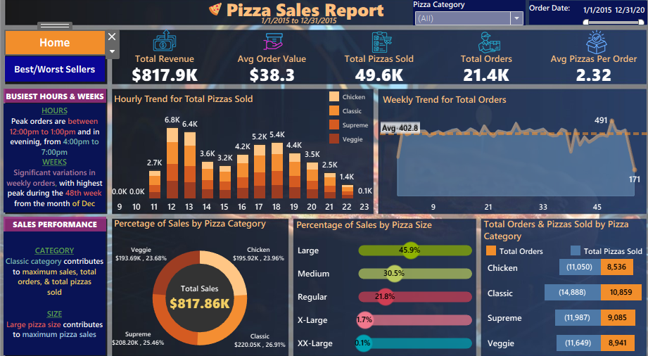

#  Pizza Sales Analysis - Interactive Dashboard

An interactive Tableau dashboard analyzing a year of pizza restaurant sales, covering revenue, order volume, peak demand times, and product performance by category and size.

**🔗 Live Dashboard:** [View on Tableau Public](https://public.tableau.com/views/pizzasales1/Home?:language=en-GB&:sid=&:redirect=auth&:display_count=n&:origin=viz_share_link)

---

##  Overview

This project explores a full year of pizza sales data (Jan 1 – Dec 31, 2015) to answer key business questions:

- How much revenue did the business generate, and what does a typical order look like?
- When are the busiest hours and weeks of the year?
- Which pizza categories and sizes drive the most sales?
- Which products are the best and worst sellers?

The dashboard is built for quick, at-a-glance decision-making, with drill-downs available by pizza category and order date.

##  Dashboard Preview

*(Screenshot of the Home page — see the live link above for the full interactive version, including the Best/Worst Sellers page.)*

##  Key Metrics (KPIs)

| Metric | Value |
|---|---|
| Total Revenue | $817.9K |
| Total Orders | 21.4K |
| Total Pizzas Sold | 49.6K |
| Average Order Value | $38.3 |
| Average Pizzas per Order | 2.32 |

##  Dashboard Pages

1. **Home** — KPI summary, hourly and weekly order trends, and sales breakdowns by pizza category and size.
2. **Best/Worst Sellers** — Ranks individual pizzas by revenue and quantity sold to surface top and bottom performers.

##  Key Insights

- **Peak hours:** Orders peak between 12:00–1:00 PM and again in the evening from 4:00–7:00 PM.
- **Peak week:** Order volume varies significantly week to week, with the highest peak in week 48 (late November).
- **Category performance:** The Classic category contributes the most to total sales, orders, and pizzas sold.
- **Size performance:** Large pizzas contribute the most to total sales (45.9% of orders), followed by Medium (30.5%) and Regular (21.8%).
- **Category revenue split:** Classic ($220.05K), Supreme ($208.20K), Veggie ($193.69K), and Chicken ($195.92K) are fairly evenly distributed, with Classic slightly ahead.

##  Built With

- **[Tableau Public](https://public.tableau.com/)** — dashboard design, visualization, and hosting
- Source data: pizza sales transactions (order-level detail including date, time, category, size, and pizza item)

##  Project Contents

- `pizza_sales_analysis_report.pptx` — presentation summarizing the dashboard and linking to the live version
- Live interactive dashboard hosted on Tableau Public (link above)

##  How to Explore

1. Click the [live dashboard link](https://public.tableau.com/views/pizzasales1/Home?:language=en-GB&:sid=&:redirect=auth&:display_count=n&:origin=viz_share_link) above.
2. Use the **Pizza Category** filter and **Order Date** range slider (top right) to drill into specific segments.
3. Switch between the **Home** and **Best/Worst Sellers** tabs to explore different views of the data.

##  Notes

- Data covers the period **January 1 – December 31, 2015**.
- This dashboard is intended for portfolio/demonstration purposes.

---

*Feel free to reach out with questions or feedback on the analysis.*
